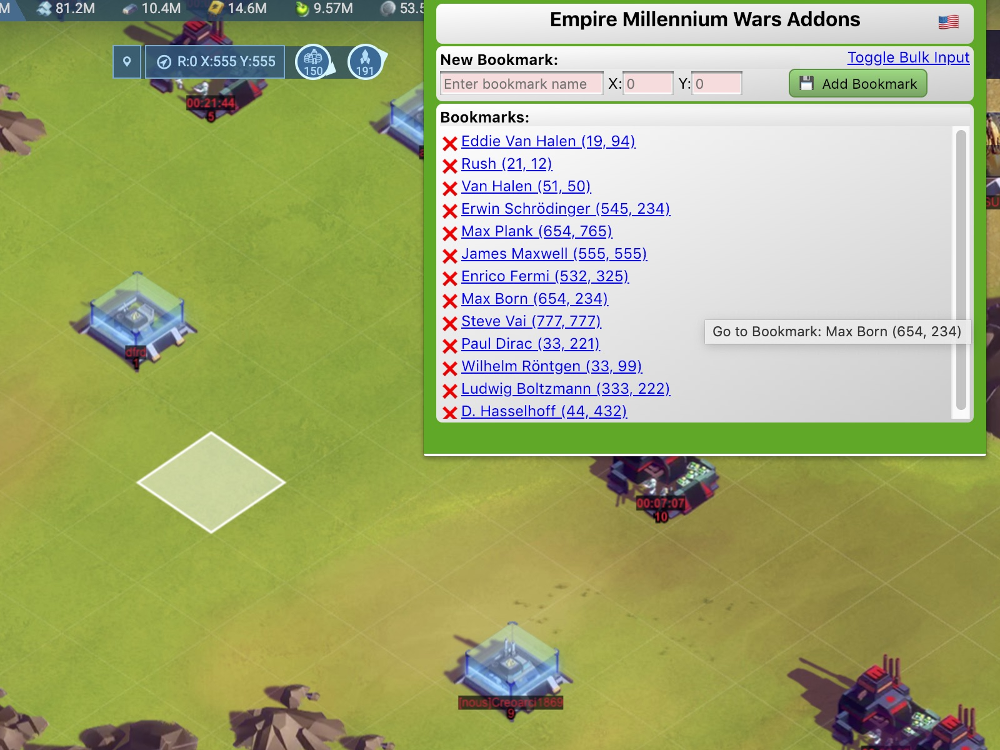

# EmpireMillenniumChatBlockerChromeExt




A Chrome Extension for the game Empire Millennium wars to block user chat messages.

To Install:
download all of the files retaining directory structure.  or use git clone:
```sh
git clone https://github.com/sflanders95/EmpireMillenniumChatBlockerChromeExt
```

Open Chrome and navigate to: <!-- this link does not work on github [chrome://extensions/](chrome://extensions/) -->
<A href="chrome://extensions/">chrome://extensions/</a>

Turn Developer mode on: &nbsp; 

Click the "Load Unpacked" button and select the directory where the manifest.json file is that you just downloaded.

Now open the [Empire Millennium Wars Game](https://empiremillenniumwars.com/ 'a goodgamesstudios crappy product').

After installing the plugin, a new icon  should have been created at the top right of the chrome window.  The Hover text over the icon will say "Block Chat Messages".  Click it to get the settings window.  Enter the text or username you wish to no longer see in the chat window and click the "Save" button.

To remove the text, click the "Erase" button.

To regain the hidden messages, use Erase function then reload the game (press F5).

\<EOF\>
<style>
.BoxShadow {
    box-shadow: 3px 3px 3px 3px rgba(0,0,0,0.75);
}
</style>